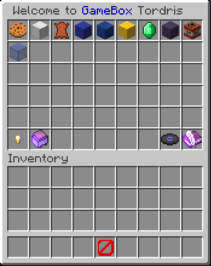

# GameBox

GameBox is a minecraft plugin written with the Bukkit API. It is published on [Spigot].

A high number of inventory games can be added to GameBox. All of them are accessible for the players through one GUI. The plugin is configurable and all messages can be changed in the language files.

## Features

* Growing number of single and multiplayer games
  * [List of all GameBox games][GameBox-games]
  * [Template game][example-project]
* Customisable GUIs, messages, titles and game modes
* Statistics and top lists
* Support for MySQL and file storage
* Token system with configurable [shop](#shop)

GameBox uses language files for messages and inventory titles. You can add your own file or use one of the default files (german, english, spanish and mandarin). [More info on the Wiki](https://github.com/NiklasEi/gamebox/wiki/Language).

All games have their own configuration and language files.

### Token

Token are a currency provided by GameBox. They can be awarded for winning games and can be used to sell items or other things in the [token shop](#shop). 

They can be accessed and given/taken through the [API](#api) and through admin commands.

### Shop

[Wiki page](https://github.com/NiklasEi/gamebox/wiki/Token-Shop)

The token shop consists of a Menu that lists all shop categories and of pages full of shop items for each category. Every shop category is automatically paginated.

Per default access to the shop is given through a button on the main GUI. The needed permission for players is **`gamebox.shop`**
and is given by default.

You can
* sell items for token and/or money.
* run commands in exchange for token and/or money.
* disable shop items for players based on the permissions they have or don't have.
* add your own categories with configurable name, lore and button.
* add as many items to any category as you want.

Shop configuration is done in the file 'tokenShop.yml' which is generated in the GameBox folder.

### API

GameBox provides an API.

Currently implemented features:
* Give/take/set token for online and offline players.
* Get the token count for an online or offline player.

[API source](src/main/java/me/nikl/gamebox/GameBoxAPI.java)

## Installation

1. Download the newest version from [Spigot].
2. Download all the GameBox games you can find on Spigot.
3. Drop it in your servers plugin folder.
4. Restart your server.
5. Configure GameBox:
   1. Change the used language file in config.yml (if you need something else then english).
   2. You should enable the hub mode ;)
   3. You can customise your tokenShop.yml and open the shop for your players.
6. Optional: configure the games
   1. The games' configuration files are in `GameBox/games/<gameID>`
   2. The games' language files are in `GameBox/language/<gameID>`

### Custom builds

Just fork and clone this repository and run 'mvn package'. The jar ready for distribution will be in the target folder in the root directory.

The included games and my nmsutilities are hosted on [my Artifactory server][artifactory]. You can check there for up to date versions.

## Commands and permissions

Please refer to the plugins page for a detailed list of commands and permissions.

[Commands list][GameBox-cmds]

[Permissions list][GameBox-perms]

The permissions allow for different players having access to different games. By default all players can play all games! To change that one has to take the permission `gamebox.play.*` from all players. Then add the game specific play permissions `gamebox.play.<gameID>`. The unique ids of all games can be found [on the project page][gamebox-ids].

[Spigot]: https://www.spigotmc.org/resources/37273/
[gamebox-ids]: https://www.nikl.me/projects/minecraft/gamebox/#ids
[GameBox-games]: https://www.nikl.me/projects/minecraft/gamebox/#games
[GameBox-cmds]: https://www.nikl.me/projects/minecraft/gamebox/#commands
[GameBox-perms]: https://www.nikl.me/projects/minecraft/gamebox/#permissions
[example-project]: https://github.com/NiklasEi/template-module-for-gamebox
[artifactory]: https://repo.nikl.me
